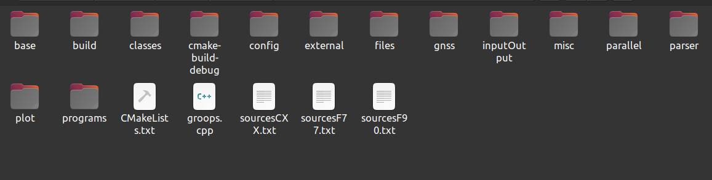
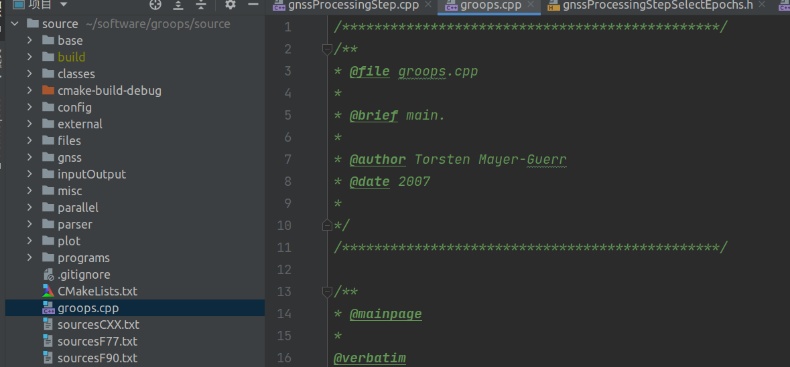
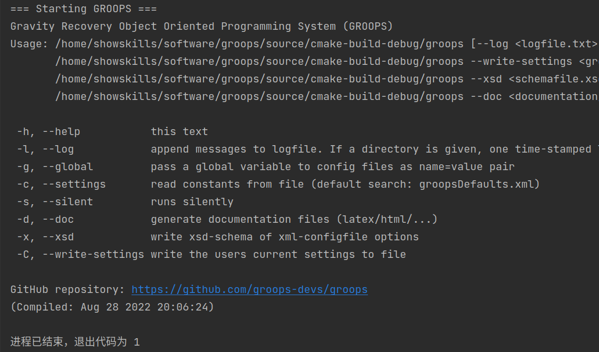
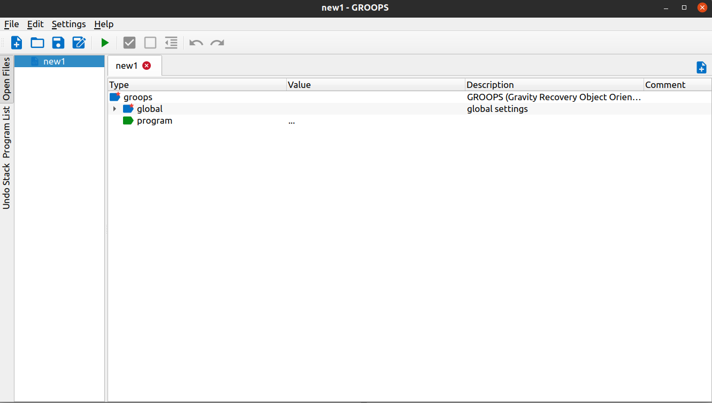

# 软件配置
- **<font color='#559F'>GitHub地址</font>**：https://github.com/groops-devs/groops
- **<font color='#559F'>官方文档</font>**：https://groops-devs.github.io/groops/html/index.html
<br>

<font color=#9900CC size=3>**笔者在Windows系统和linux中都曾配置过GROOPS，Windows系统配置步骤十分繁杂，容易因为系统问题出错，甚至需要修改部分代码，花了我很长时间。而在Ubuntu系统下，根据官方文档输入指令，步骤十分简单，一步到位，所以这里建议大家在linux系统中使用该软件。**</font>
<br>

- **<font color='#559F'>软件配置文档</font>**：https://github.com/groops-devs/groops/blob/main/INSTALL.md#ubuntu
<br>

<font color=green size=3>**1、首先需要更新自己的系统：**</font>
```
sudo apt update && sudo apt upgrade
```
<font color=green size=3>**2、安装依赖项和构建工具：**</font>
```
sudo apt-get install g++ gfortran cmake libexpat1-dev libopenblas-dev
```
<font color=green size=3>**3、安装NetCDF开发包（可选）：**</font>
```
sudo apt-get install libnetcdf-dev
```
<font color=green size=3>**4、安装liberfa开发包（可选）：**</font>
```
sudo apt-get install liberfa-dev
```
<font color=green size=3>**5、安装MPI开发包（可选）：**</font>
```
sudo apt-get install mpi-default-dev
```
<font color=green size=3>**6、创建构建目录并编译GROOPS：**</font>
```
mkdir $HOME/groops/source/build && cd $HOME/groops/source/build
cmake .. -DCMAKE_BUILD_TYPE=Release -DCMAKE_INSTALL_PREFIX=$HOME/groops
make -j4
make install
```
**<font color=red>注意：这里需要注意一下GROOPS的项目的目录，即从GitHub上clone下来的项目，这里是默认在$HOME/groops路径下。</font>**
<br>

<font color=#9900CC size=3>**完成上述步骤后，在项目的source文件夹下则会出现由CMake构建的整个项目：**</font>



<font color=#9900CC size=3>**用编译器打开这个source文件夹，就可以在源码上使用该软件，我这里选择用CLion打开该项目，可以直接运行：**</font>



<font color=#9900CC size=3>**GROOPS是使用命令行处理数据的，笔者这里没有在编译器设置命令行参数，因此运行结果默认为GROOPS的使用提示：**</font>


<br>

<font color=#9900CC size=3>**官方很贴心的提供了该软件的界面版，即用Qt编写的GUI界面，同样需要自己编译，但是在linux下编译十分简单。步骤如下：**</font>

<font color=green size=3>**1、GROOPS GUI依赖于Qt包，要安装所需的软件包：**</font>
```
sudo apt-get install qtbase5-dev
```
<font color=green size=3>**2、编译gui项目，这里同样需要注意文件路径：**</font>
```
cd $HOME/groops/gui
qmake
make
```

<font color=#9900CC size=3>**大功告成，如果安装过Qt的话则可以直接打开gui文件夹中的`groopsGui.pro`文件，运行可以得到界面；如果没有安装Qt，则可以在上一级文件夹中找到bin文件夹，打开后可以看见`groopsGui`可执行文件，然后在此处打开终端，运行./groopsGui，即可打开界面：**</font>


<br>

***
<font color=#333CCC>**写在后面**</font>：<font color=green>**下一节笔者将会介绍GROOPS软件使用精密单点定位的流程，并结合官方的使用示例，另外该软件定位功能需要结合初始的官方的一些配置文件，不会上外网的同学可能很难拿到，下一节笔者同样会提供该文件给大家下载。**</font>
***

